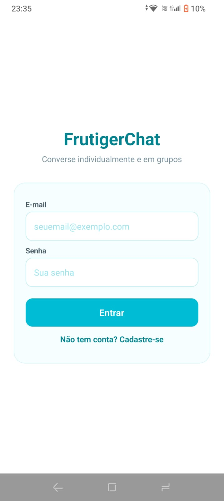
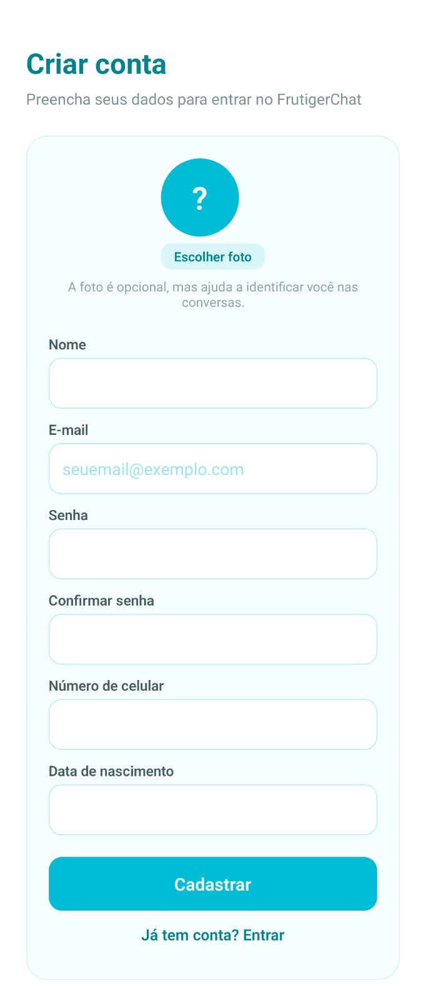
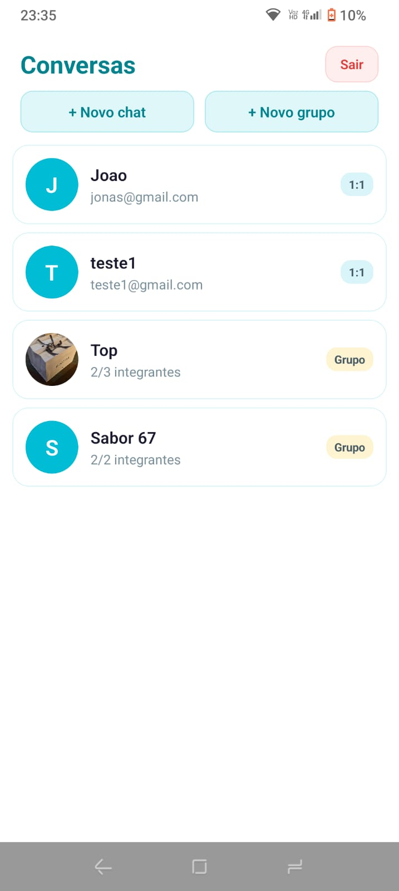
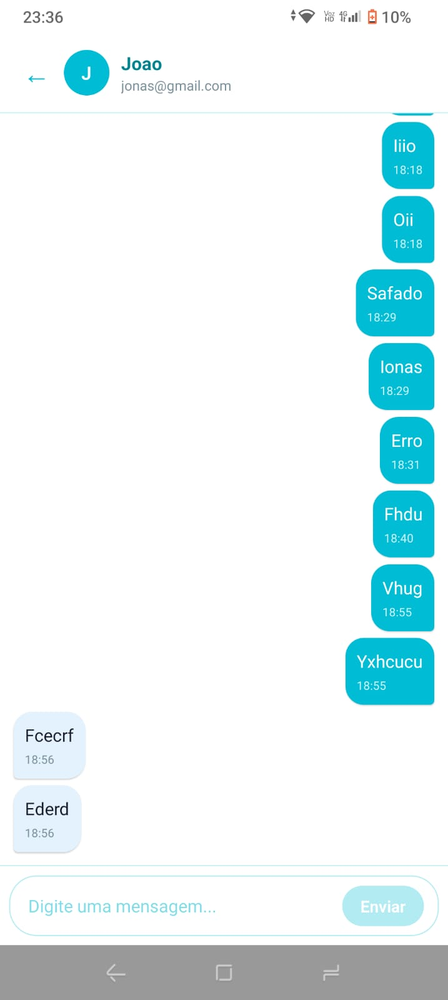
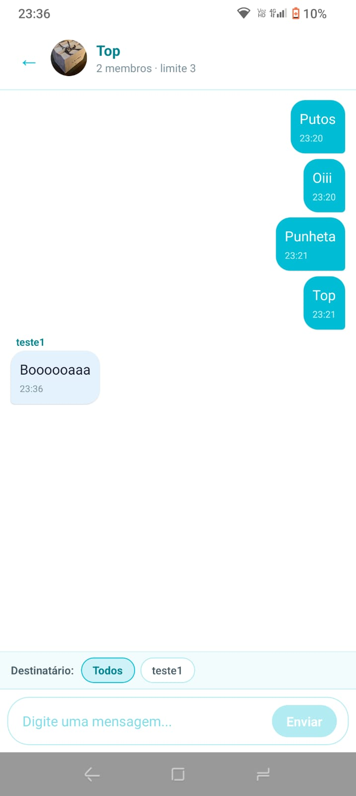
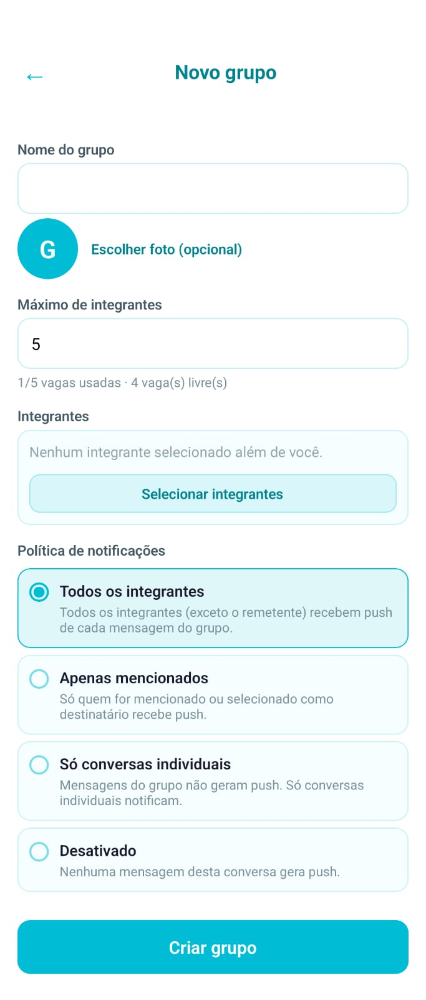
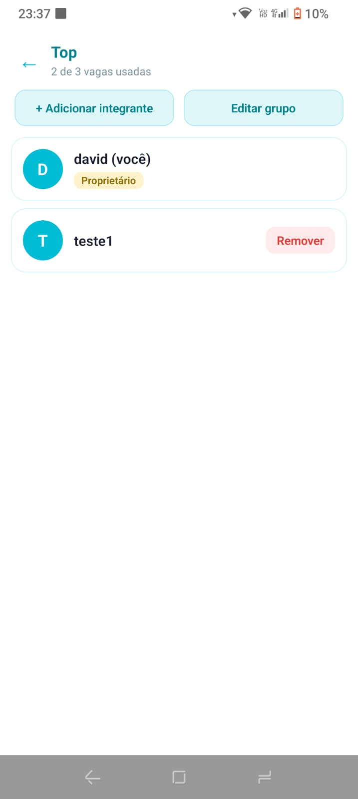
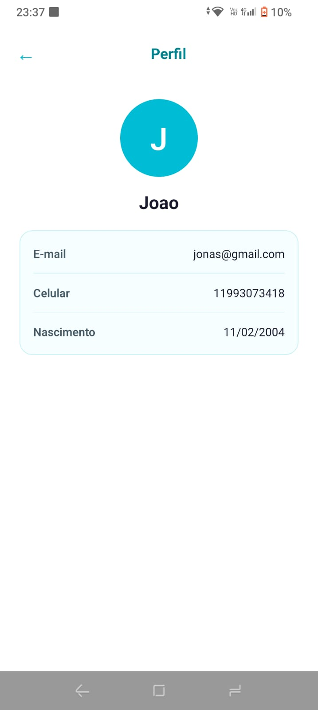
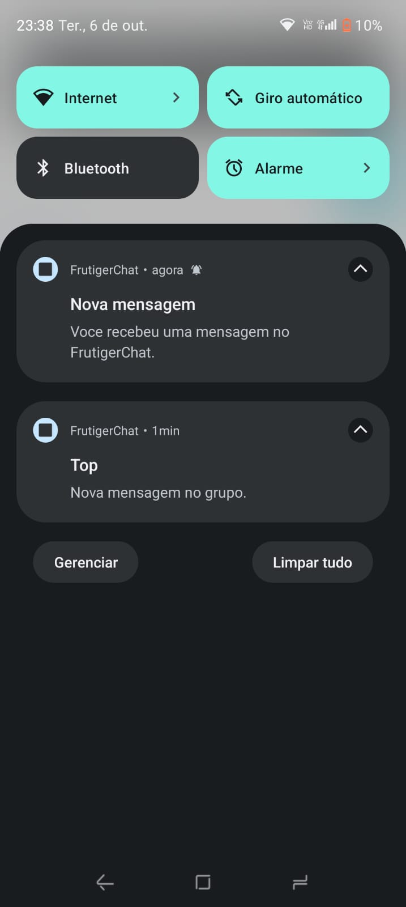

# FrutigerChat

Aplicativo de chat em React Native com TypeScript, usando Firebase como backend. Permite conversas individuais (1 para 1) e conversas em grupo entre usuários autenticados por e-mail e senha, com mensagens sincronizadas em tempo real e notificações push enviadas por uma API própria da equipe.

## Integrantes

- Denise Senise — RM 556006
- Larissa Rodrigues Lapa — RM 554517
- Mateus Leme — RM 557803
- David Gabriel Gomes Fernandes — RM 556020
- Vinicius Augusto Neves Prestes — RM 559097

## Tecnologias

- React Native 0.83.10
- **Expo SDK 55**
- React 19.2
- TypeScript 5.6
- Firebase Authentication (apenas e-mail e senha)
- Firebase Realtime Database (mensagens)
- Cloud Firestore (perfis, grupos, conversas individuais, dispositivos)
- Firebase Cloud Messaging (FCM) para o push
- imgbb (armazenamento das fotos de perfil e de grupo — serviço externo, plano gratuito)
- Expo Notifications (token e recepção do push no app)
- Node.js + Express + Firebase Admin SDK (API de notificações)

## Serviços Firebase e responsabilidade de cada um

| Serviço | O que faz no projeto |
|---|---|
| **Authentication** | Cadastro e login com e-mail/senha, recuperação de sessão, identificador `uid`, logout |
| **Realtime Database** | Mensagens (individuais e de grupo), listeners em tempo real das conversas |
| **Cloud Firestore** | Perfis dos usuários, grupos e metadados, integrantes, limite de integrantes, política de notificações, tokens de dispositivos, conversas individuais |
| **Cloud Messaging (FCM)** | Entrega do push em segundo plano/fechado; a conversa de origem vai no payload |
| **imgbb** (serviço externo) | Arquivos das fotos de perfil e de grupo (no Firestore fica só a URL) |

## Estrutura do projeto

```
├── App.tsx
├── app.json
├── firebaseConfig.json        # config do SDK cliente (versionada de propósito)
├── .env.example               # variaveis do app (URL da API, chave do imgbb)
├── firestore.rules            # regras do Firestore
├── database.rules.json        # regras do Realtime Database
├── server/                    # API de notificações (Express + firebase-admin)
│   ├── src/
│   │   ├── app.ts
│   │   ├── middleware/authenticate.ts
│   │   ├── routes/notifications.ts
│   │   └── services/
│   │       ├── firebaseAdmin.ts
│   │       ├── notificationSender.ts
│   │       └── recipientResolver.ts
│   ├── test/                  # testes (node:test)
│   ├── package.json
│   └── .env.example
└── src/
    ├── components/            # Avatar, ChatMessage, ChatInput, ConversationItem,
    │                          # GroupMemberItem, UserItem, Loading, ErrorMessage
    ├── contexts/
    │   └── AuthContext.tsx    # estado da sessao + perfil
    ├── hooks/
    │   ├── useAuth.ts
    │   ├── useChat.ts         # mensagens da conversa aberta
    │   ├── useGroups.ts       # grupos do usuario
    │   └── useNotifications.ts# permissao, token e toque na notificacao
    ├── navigation/
    │   └── AppRouter.tsx      # pilha de rotas
    ├── screens/
    │   ├── LoginScreen.tsx
    │   ├── RegisterScreen.tsx
    │   ├── ConversationsScreen.tsx
    │   ├── UsersScreen.tsx
    │   ├── GroupFormScreen.tsx
    │   ├── ChatScreen.tsx
    │   ├── ProfileScreen.tsx
    │   └── GroupMembersScreen.tsx
    ├── services/
    │   ├── firebase.ts        # inicializacao dos SDKs
    │   ├── authService.ts
    │   ├── userService.ts     # perfis, foto, dispositivos
    │   ├── groupService.ts    # grupos, limite, integrantes
    │   ├── chatService.ts     # conversas e mensagens (RTDB)
    │   └── notificationService.ts # permissao, token, chamada a API
    ├── types/
    │   ├── user.ts
    │   ├── chat.ts
    │   ├── group.ts
    │   └── notification.ts
    └── utils/
        ├── conversationId.ts
        ├── groupValidation.ts
        └── parseData.ts
```

## Instalação e execução

### Aplicativo

```bash
npm install
npx expo start
```

Para push de verdade (FCM direto) é preciso uma **development build** ou build nativo, não o Expo Go:

```bash
npx expo run:android
npx expo run:ios
```

### API de notificações

```bash
cd server
npm install
npm run dev      # desenvolvimento (porta 3001)
npm run build && npm start   # produção
npm test         # testes
```

A API lê as credenciais do Firebase Admin pela variável de ambiente (veja "API de notificações" abaixo).

## Configuração do Firebase

1. Projeto no Firebase Console com: Authentication (e-mail/senha), Realtime Database, Cloud Firestore e Cloud Messaging habilitados. As fotos não usam o Firebase: ficam no imgbb (controle > API, para obter a chave).
2. A configuração do SDK **cliente** fica no arquivo `firebaseConfig.json` na raiz (versionado no repositório, como pedido no enunciado). O app lê esse arquivo direto — não há segredo ali, é o identificador público do projeto.
3. As regras de segurança ficam versionadas em `firestore.rules` e `database.rules.json`. Publique com o Firebase CLI:

```bash
firebase deploy --only firestore:rules
firebase deploy --only database:rules
```

4. O `.env` do app **já está versionado no repositório com os valores reais** (pedido do professor, para testar direto no Expo Go sem configurar nada): URL pública da API publicada no Render e chave do imgbb. O `.env.example` lista as mesmas variáveis com marcadores, para referência.

## Fotos: onde ficam as imagens

As fotos de perfil e de grupo são escolhidas na galeria do aparelho (Expo Image Picker, que pede a permissão de acesso à biblioteca) e enviadas ao **imgbb** (plano gratuito; a chave da conta fica em `EXPO_PUBLIC_IMGBB_KEY` no `.env` do app, listada no `.env.example`). **Apenas a URL** resultante é gravada no Firestore — nenhuma imagem é salva em Base64 no banco. O Firebase Storage não foi utilizado porque a criação do bucket exige conta de cobrança (plano Blaze), fora do escopo deste trabalho; o enunciado admite outra solução de armazenamento. Se a foto não existir ou falhar ao carregar, a interface mostra um avatar padrão com a inicial do nome.

## Notificações push: configuração

### Como funciona o fluxo

1. O app pede permissão de notificação e registra o token FCM no Firestore em `users/{uid}/devices/{deviceId}` (token, plataforma, `enabled`, data).
2. O usuário envia a mensagem → ela é persistida no Realtime Database.
3. O app chama a **API da equipe** com `conversationId` + `messageId` e o ID Token do Firebase (header `Authorization: Bearer`).
4. A API valida o token com o Admin SDK, confere no RTDB que a mensagem existe e que o remetente bate, consulta no Firestore os participantes e a política, calcula os destinatários (nunca confia numa lista vinda do app) e envia pelo FCM.
5. Tokens inválidos são removidos do Firestore quando o FCM responde que o token morreu.

### Android

A configuração é feita pelo plugin `expo-notifications` no `app.json`. Em development build, o token gerado é o próprio FCM e a API entrega direto. Em produção (Play Store) seria necessário gerar o app com o `googleServices.json` do projeto.

### iOS

Mesmo plugin. Para receber push com o app fechado, o build precisa ter o capability *Push Notifications* ativado (o plugin já adiciona o `remote-notification` em background). Em development build o FCM funciona direto.

> O push foi testado em **dispositivo físico** (development build). No Expo Go o token gerado é o do serviço do Expo e não o FCM, por isso o build nativo é obrigatório para validar o push.

### Política de notificações de cada grupo

| Política | Comportamento |
|---|---|
| `all_group_messages` | Mensagem geral do grupo → push para todos os integrantes, exceto o remetente |
| `mentioned_members` | Push só para quem foi selecionado/mencionado como destinatário |
| `direct_messages_only` | Mensagens de grupo não geram push; só conversas 1:1 notificam |
| `disabled` | Nada gera push naquela conversa |

Conversas individuais sempre notificam o outro participante (o remetente nunca recebe push da própria mensagem). A política é configurada pelo dono do grupo na tela de criação/edição.

O texto da notificação não leva o conteúdo da mensagem (só "Nova mensagem no grupo X") e o payload de dados sempre contém `conversationId` e `conversationType` — ao tocar na notificação o app abre a conversa certa.

### Anti-duplicata

A API grava uma marca `sentNotifications/{messageId}` no Firestore dentro de uma transação: se a requisição for reenviada (rede caiu, cliente repetiu), a segunda chamada recebe `409` e não reenvia push.

## API de notificações

### Tecnologia e hospedagem

Node.js + Express + TypeScript + Firebase Admin SDK, hospedada com URL pública HTTPS.

**URL pública da API:** `https://frutigerchat.onrender.com`

### Endpoints

| Método | Rota | Descrição |
|---|---|---|
| `GET` | `/health` | Health check, responde `{ status: "ok" }` |
| `POST` | `/notifications/messages` | Corpo: `{ "conversationId": "...", "messageId": "..." }`. Header: `Authorization: Bearer <firebase-id-token>`. Responde com a quantidade de destinatários e de entregas |

### Como verificar se a API está no ar

```bash
curl https://frutigerchat.onrender.com/health
```

Resposta esperada:

```json
{ "status": "ok", "service": "frutigachat-api", "timestamp": "..." }
```

### Variáveis de ambiente da API (configuradas só na hospedagem)

- `FIREBASE_PROJECT_ID` — id do projeto Firebase
- `FIREBASE_CLIENT_EMAIL` — e-mail da conta de serviço do Admin SDK
- `FIREBASE_PRIVATE_KEY` — chave privada da conta de serviço
- `PORT` — porta do servidor

As credenciais administrativas (conta de serviço) **não estão no repositório nem no app**: ficam apenas nas variáveis secretas da hospedagem. O `.env.example` da API lista os nomes com valores fictícios.

### Rodando localmente

```bash
cd server
cp .env.example .env   # preencher com as credenciais da sua conta de servico
npm run dev
```

## Limite de integrantes de grupo: proteção contra concorrência

Cada grupo tem `memberLimit` (definido na criação, editável pelo dono, nunca menor que o número de integrantes atuais). As proteções, em camadas:

1. **Interface**: mostra vagas usadas/livres e desabilita a adição quando o grupo está cheio.
2. **Transação no Firestore** (`runTransaction`): a adição de integrante lê o grupo, verifica a vaga e grava `arrayUnion` atomicamente. Se dois clientes adicionarem ao mesmo tempo, um re-tenta depois do commit do outro — ninguém "perde" a escrita e o limite não estoura.
3. **Regras do Firestore** (última defesa): qualquer update em que `size(memberIds) > memberLimit` ou `memberLimit < size(memberIds)` é negado pelo próprio banco, mesmo que o app tenha um bug.
4. **API**: ao processar o push, a API reconsulta os integrantes atuais no Firestore, então quem foi removido não recebe mais notificação.

## Segurança

- **Firestore**: só autenticado lê/escreve. Usuário só edita o próprio perfil e os próprios dispositivos. Em `directConversations`, só participantes. Em `groups`, leitura para integrantes; update só do dono, sem trocar o dono, sem sair do próprio grupo, respeitando o limite. `sentNotifications` só aceita escrita administrativa (Admin SDK).
- **Realtime Database**: mensagem só é gravada por quem é o `senderId` autenticado, com texto válido (1 a 1000 chars), tipo de conversa válido e `target` bem formado.
- **Limitação documentada**: as regras do RTDB não conseguem consultar o Firestore (e vice-versa), então a checagem "o remetente ainda é integrante do grupo" para o push é feita pela **API**, que consulta os integrantes atuais antes de entregar. A interface também bloqueia o envio assim que o usuário é removido (a leitura do grupo passa a dar erro de permissão).
- O app nunca dispara FCM: o push só sai pela API, que valida o ID Token.

## Telas

| Tela | O que tem |
|---|---|
| Login | e-mail, senha, erro de credencial, loading, link para cadastro |
| Cadastro | nome, e-mail, senha + confirmação, celular, data de nascimento, foto de perfil, validações |
| Conversas | lista de conversas 1:1 e grupos (com selo), criar chat, criar grupo, logout, aviso se push estiver desativado |
| Usuários | busca por nome/e-mail, inicia conversa individual, seleção de integrantes para grupo |
| Grupo (criar/editar) | nome, foto, limite (com vagas), integrantes, política de notificação, validações |
| Chat | mensagens em tempo real, autor em grupo, destinatário/menção, rolagem automática, vazio, falha de envio |
| Integrantes do grupo | lista com foto, dono, remoção (donos), adicionar (respeitando o limite), acesso ao perfil |
| Perfil | foto, nome, e-mail, celular, nascimento; campos ausentes como "Não informado"; bloqueado para quem não compartilha conversa |

### Prints

















**Notificação push recebida (evidência):**


